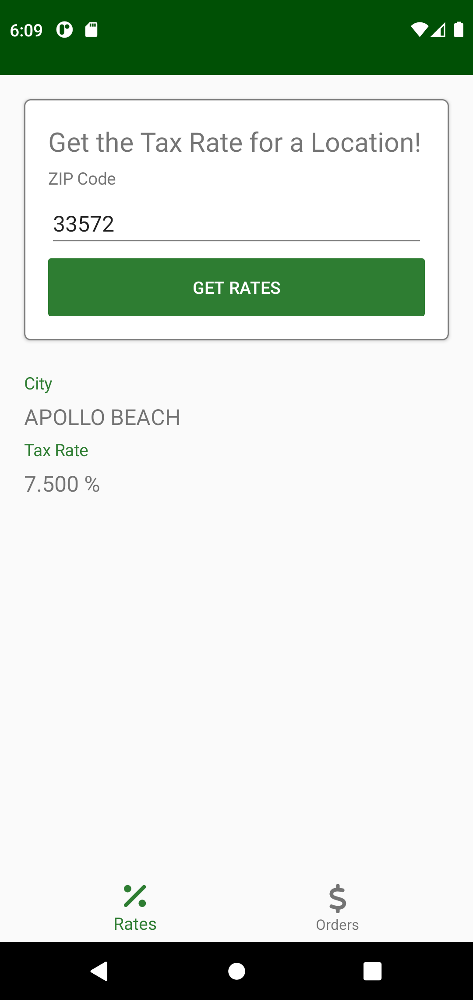
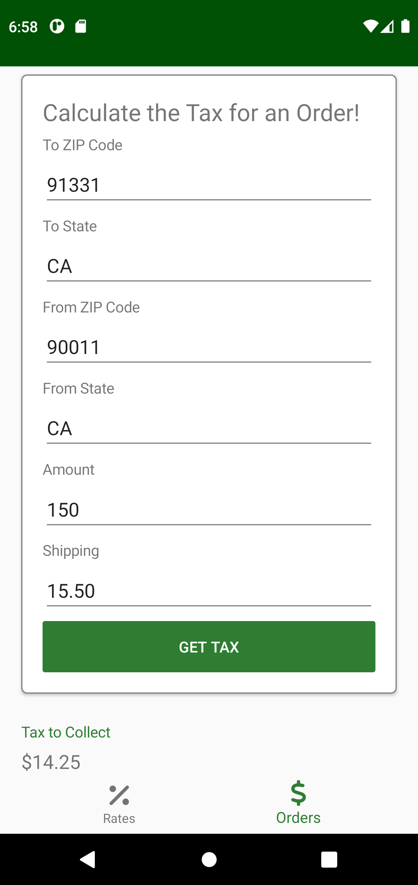
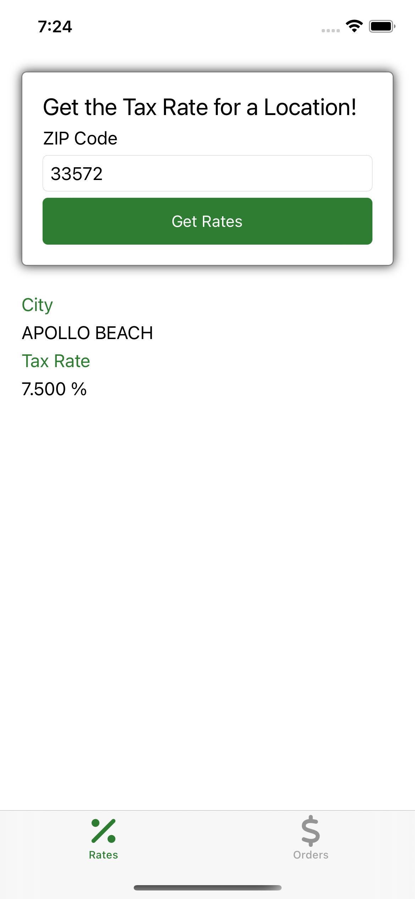
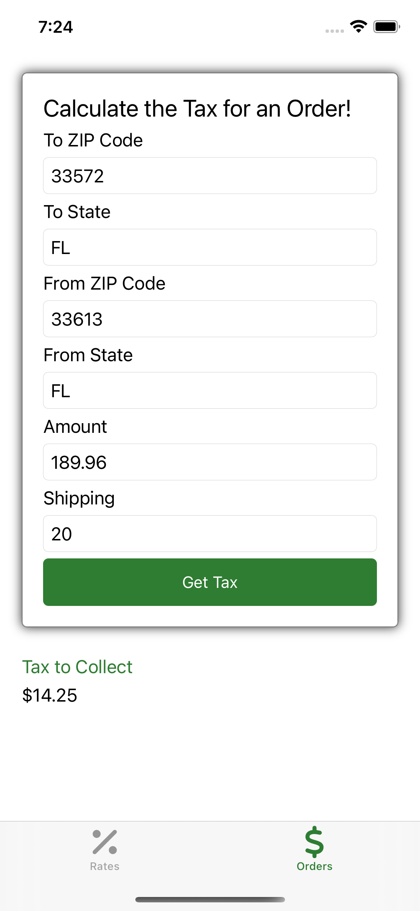

# 🧮 TaxCalculator

This Xamarin Forms app uses the TaxJar API to calculate the tax rate for a specified location and the tax to collect for an order.

## ⚠️ Setting up TaxJar ⚠️
To avoid checking in the ApiKey to source control it was excluded from `TaxCalculator/appsettings.json`.

Please update the ApiKey setting inside of `TaxCalculator/appsettings.json` and replace `XXX` to properly authenticate to TaxJar.

## 💻 Tech Used
- .Net Standard 2.1
- C# version 9
- [Xamarin Forms](https://www.nuget.org/packages/Xamarin.Forms/)
- [Xamarin Community Toolkit](https://www.nuget.org/packages/Xamarin.CommunityToolkit/)
- [Refractored.MvvmHelpers](https://www.nuget.org/packages/Refractored.MvvmHelpers/)
- [Microsoft Extensions Dependency Injection](https://www.nuget.org/packages/Microsoft.Extensions.DependencyInjection/)

### Things I would improve with more time
- I would most likely add some form of local caching for location rates.
- I would like to incorporate a nicer loading animation.
- I would like to improve the result UI instead of just displaying a label.
- I would like to create a shared state picker so XAML is a little cleaner.

### Things I would polish with more time
- Calculating an order tax between two states returns 0 sometimes. Not sure if this is correct or maybe I am calling the TaxJar API incorrectly.
- The disabled button on the order page does not calculate the amount and shipping validation correctly sometimes.

## 📸 Screenshots

